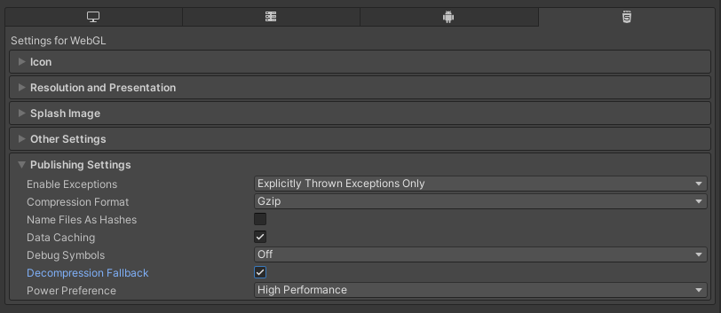
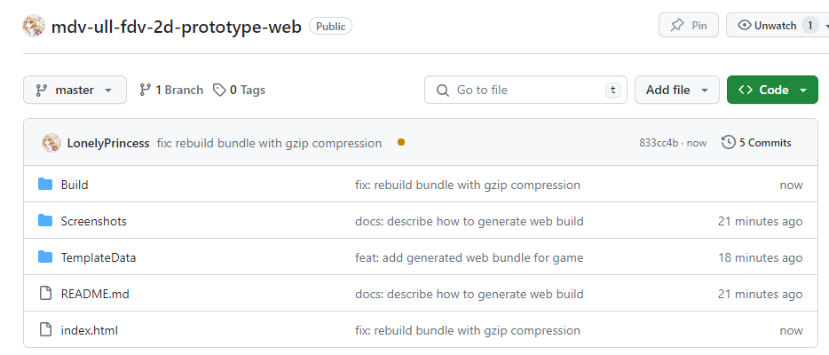
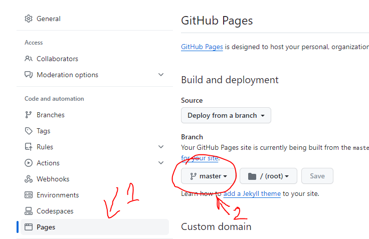
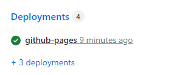
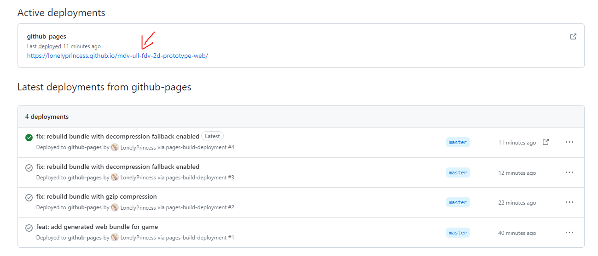

# Adapting an Unity game to the web platform

## Introduction

This project showcases **how to convert an existing Unity project into a functional web application**, as well as how to deploy it in [GitHub Pages](https://pages.github.com/) so people can access it online without any cost.

The game used in this example can be found [here](https://github.com/LonelyPrincess/mdv-ull-fdv-2d-prototype), although steps to follow would be the same for any other project. If you'd like to get more information on the game itself, refer to the forementioned repository. Current repository contains the outcoming WebGL bundle alone, and focus entirely in the process of porting an existing Unity project to the web platform.

As a result of following the steps described in this document, the web version of the game can be seen and tested [in this page](https://lonelyprincess.github.io/mdv-ull-fdv-2d-prototype-web/).

## Development journal

### 🔄 Convert Unity project to WebGL

Converting an existing Unity project to WebGL requires that you have **Unity's WebGL module** installed in your system. If you haven't done so yet, you can install it using [Unity Hub](https://docs.unity3d.com/Manual/webgl-gettingstarted.html).

Next step requires that you to open the project that you'd like to port, and then access the _"Build Settings"_ option in the main _"File"_ menu, which is the place that will allow us to change the target platform for our game. As in this case we'd like to convert our game to a web application, we'll need to select _"WebGL"_ as the target platform and click on _"Switch Platform"_ to start the conversion.


Once conversion ends we should be able to generate a build, but before we do so it's a good idea to access the _"Player"_ section in the _"Project Settings"_ menu to customize some metadata and layout settings for the generated application.


As seen in the previous picture, parameters we can customize for the web platform include an icon for our game or the splash animation that will be rendered while the game loads, as well as metadata on the game's title and author. It's also possible to choose a screen resolution that works well for our game, which can be useful to ensure the desired aspect ratio is maintained in its web version.

### 🚧 Generate WebGL build

Once we have made all desired customizations in the _"Project Settings"_ menu as described above, there's one important parameter in the _"Publishing Settings"_ section that we need to change to avoid issues when deploying our application in [GitHub](https://github.com/). More specifically, we need to enable the option _"Decompression fallback"_ to avoid encountering the following error:

```
Unable to parse Build/WebGL.framework.js.gz! This can happen if build compression was enabled but web server hosting the content was misconfigured to not serve the file with HTTP Response Header "Content-Encoding: gzip" present. Check browser Console and Devtools Network tab to debug.
```

Although not mandatory, we could also change the compression method to _"GZip"_ instead the one that's selected by default (_"Brotli"_). Whereas the later has a better compression ratio, _"GZip"_ is more widely supported across different browsers.



After we've made the required adjustments to the compression settings, we can now return to _"Build Settings"_ to generate a bundle with our game ready to be deployed on a web server. This can be done by clicking on _"Build"_ while the _"WebGL"_ platform is selected.


Clicking on this button will prompt us to enter the location where we wish to store the generated bundle. After the process has finished, we should see the following in the output folder that we selected:


The `index.html` will be the page used to render our game, while `Build` contains the actual bundle with Unity's core functionality and our game as a whole. `TemplateData` will contain a few assets that will be used in the final page, such as images, CSS styles and the favicon of the page.

### 🚀 Deploying game to GitHub pages

In order to be able to publish our game in GitHub, it's necessary that we create a new repository for it. There we'll need to upload all the files generated earlier, making sure they're all included in the root folder of our repository.



The next (and last) step to finally have our game online involves accessing the _"Settings"_ tab in our repository and enable the feature to deploy changes in [GitHub Pages](https://pages.github.com/). For that, all we need to do is to select the branch where we have the files that we'd like to publish. In this case, as it's a quite simple repository, I've chosen the default `master` branch because there aren't more.



Keep in mind **this feature is only available for free in public repositories**, so you won't be able to activate [GitHub Pages](https://pages.github.com/) in a private repository unless you own a [paid GitHub account](https://github.com/pricing). If you don't want to pay for a subscription with more priviledges, make sure you switch the visibility of your repository to _"Public"_.

Once you've enabled pages in the repository, you'll notice a new _"Deployments"_ section in the repository's main page indicating when changes were published for the last time.



Clicking on this section will take you to the detailed view with the list of past deployments plus the currenctly active version, as seen in the picture below:



In that page you'll also find the URL of your game, which you can use to see it live and play it online.

## Additional information

### 🔗 References

- [Host Unity games on GitHub pages](https://medium.com/@aboutin/host-unity-games-on-github-pages-for-free-2ed6b4d9c324)
- [Unity Docs - Player Settings Splash Screen](https://docs.unity3d.com/Manual/class-PlayerSettingsSplashScreen.html)
- [StackOverflow - Unable to parse Build/build.framework.js.br](https://stackoverflow.com/questions/72453065/unable-to-parse-build-build-framework-js-br)
- [Unity Docs - WebGL: Compressed builds and server configuration](https://docs.unity3d.com/2020.1/Documentation/Manual/webgl-deploying.html)

### 🎨 Resources

- [FDV 2D Prototype](https://github.com/LonelyPrincess/mdv-ull-fdv-2d-prototype)
