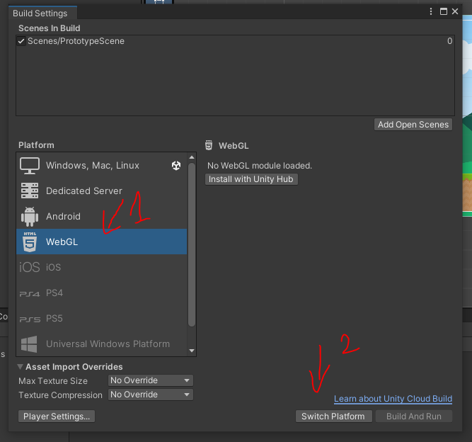
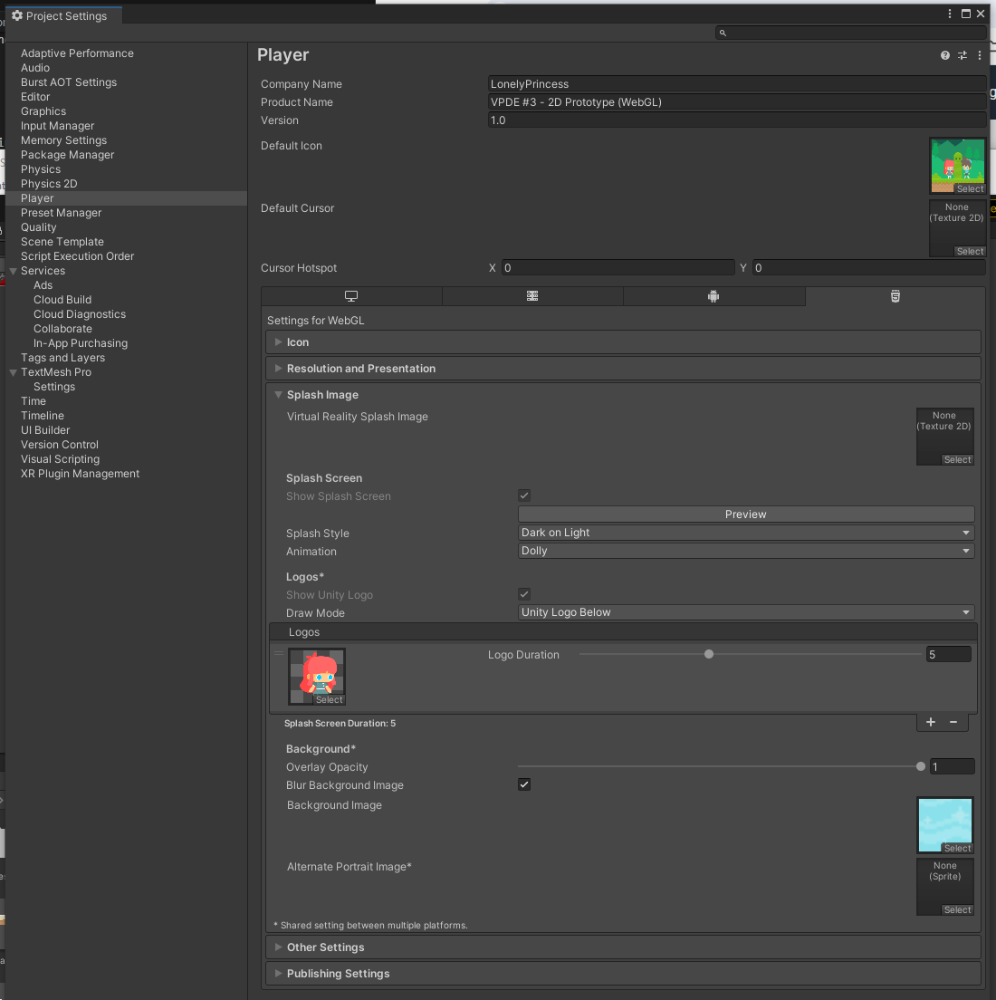
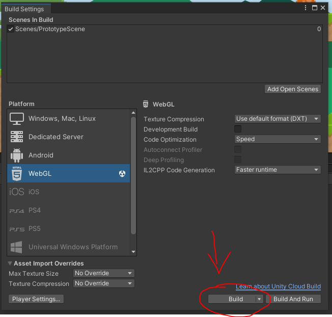
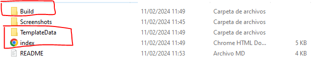

# Porting Unity game to web platform

## Introduction

This project showcases **how to convert an existing Unity project into a functional web application**, as well as how to deploy it in [GitHub Pages](https://pages.github.com/) so people can access it online without any cost.

The game used in this example can be found [here](https://github.com/LonelyPrincess/mdv-ull-fdv-2d-prototype), although steps to follow would be the same for any other project. If you'd like to get more information on the game itself, refer to the forementioned repository. Current repository contains the outcoming WebGL bundle alone, and focus entirely in the process of porting an existing Unity project to the web platform.

## Development journal

### 🎮 Convert Unity project to WebGL

Converting an existing Unity project to WebGL requires that you have **Unity's WebGL module** installed in your system. If you haven't done so yet, you can install it using [Unity Hub](https://docs.unity3d.com/Manual/webgl-gettingstarted.html).

Next step requires that you to open the project that you'd like to port, and then access the _"Build Settings"_ option in the main _"File"_ menu, which is the place that will allow us to change the target platform for our game. As in this case we'd like to convert our game to a web application, we'll need to select _"WebGL"_ as the target platform and click on _"Switch Platform"_ to start the conversion.

Once conversion ends we should be able to generate a build, but before we do so it's a good idea to access the _"Player"_ section in the _"Project Settings"_ menu to customize some metadata and layout settings for the generated application.

As seen in the previous picture, parameters we can customize for the web platform include an icon for our game or the splash animation that will be rendered while the game loads, as well as metadata on the game's title and author. It's also possible to choose a screen resolution that works well for our game, which can be useful to ensure the desired aspect ratio is maintained in its web version.

### 🖥️ Generate WebGL build

Once we have made all desired customizations in the _"Project Settings"_ menu as described above, we can now return to _"Build Settings"_ to generate a bundle with our game ready to be deployed on a web server. This can be done by clicking on _"Build"_ while the _"WebGL"_ platform is selected.

Clicking on this button will prompt us to enter the location where we wish to store the generated bundle. After the process has finished, we should see the following in the output folder that we selected:

The `index.html` will be the page used to render our game, while `Build` contains the actual bundle with Unity's core functionality and our game as a whole. `TemplateData` will contain a few assets that will be used in the final page, such as images, CSS styles and the favicon of the page.

### 🚀 Deploying game to GitHub pages

TODO

## Additional information

### 🔗 References

- [Host Unity games on GitHub pages](https://medium.com/@aboutin/host-unity-games-on-github-pages-for-free-2ed6b4d9c324)
- [Unity Docs - Player Settings Splash Screen](https://docs.unity3d.com/Manual/class-PlayerSettingsSplashScreen.html)

### 🎨 Resources

- [FDV 2D Prototype](https://github.com/LonelyPrincess/mdv-ull-fdv-2d-prototype)
